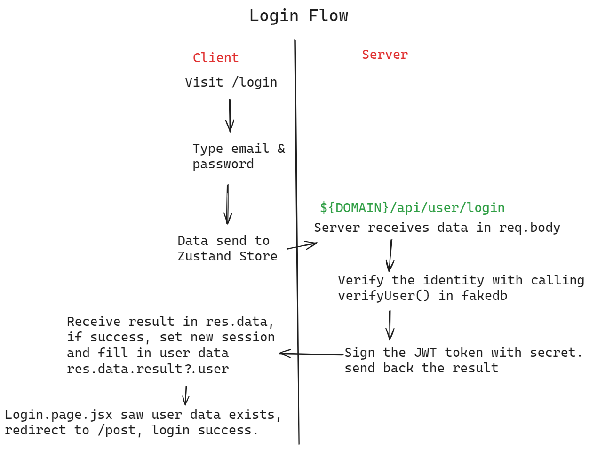
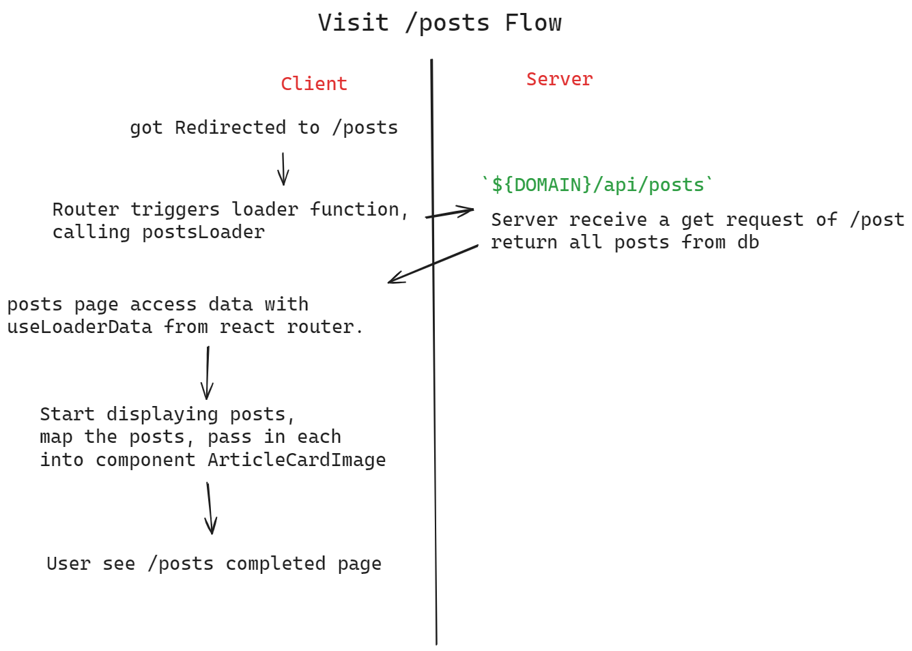
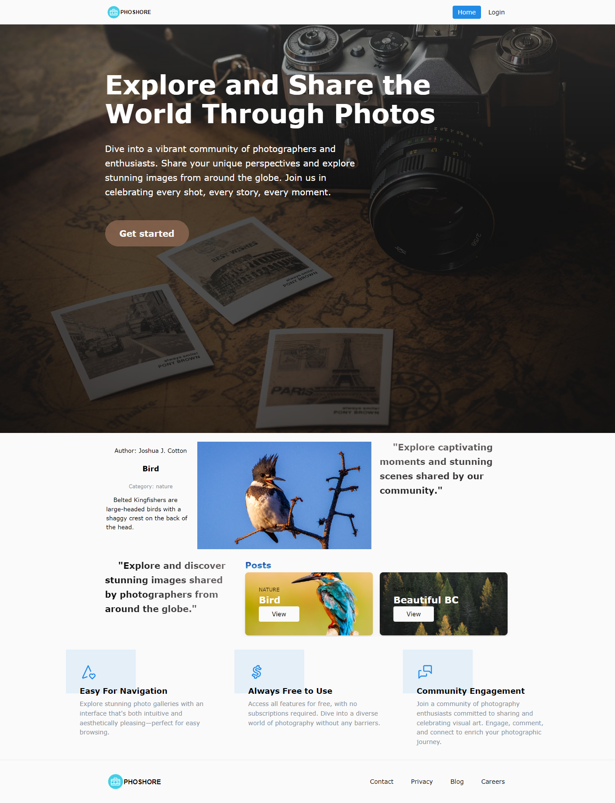
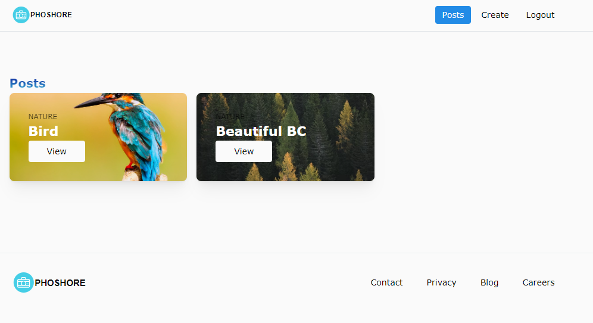
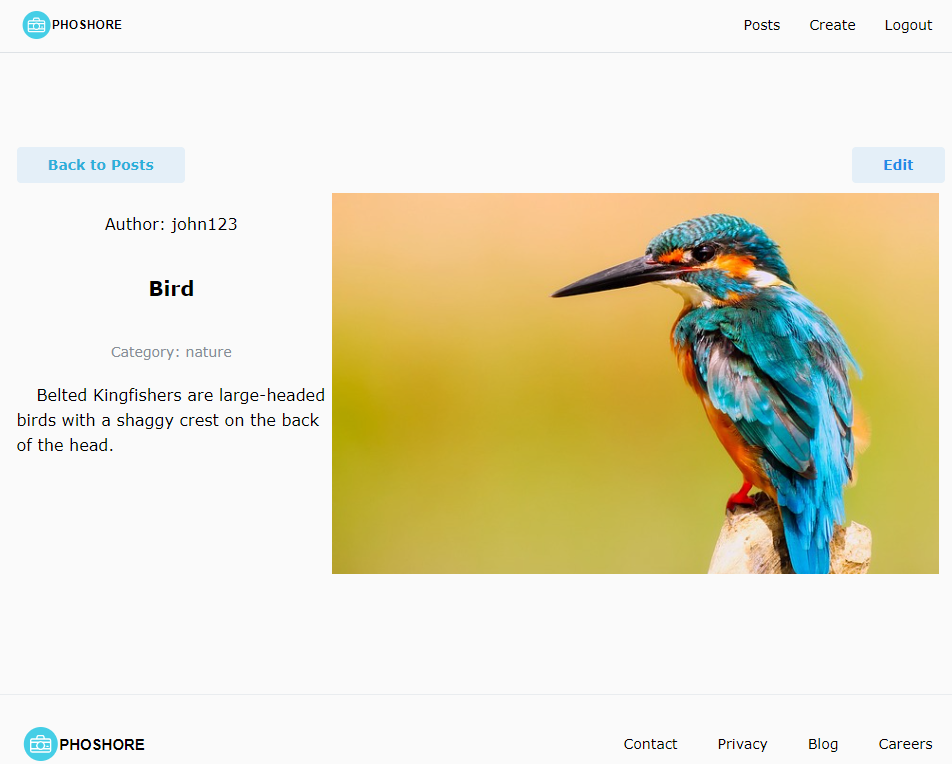

# simple-fullstack-reactpostapp
The Login Flow


The /posts Get flow


# Full-Stack Photo Sharing Application

This project is a full-stack web application for sharing photos. It allows users to log in, create posts with image url and descriptions, and view posts shared by others. Users can also edit or delete their own posts. The application uses a React frontend with Mantine for UI components and Nodejs + Express backend for API services.

## Features

- **User Authentication**: login mechanism.
- **Post Management**: Users can create, view, edit, and delete their own posts.
- **Image Sharing**: Users can upload and share images categorized by title and description with other users.
- **Responsive UI**: Built with Mantine, the application is fully responsive and accessible across all devices.

## Implemented Using: 

### Frontend:
- React Vite for building the user interface.
- Mantine lib for styled UI components.
- Zustand for state management.
- (used the new anchor positioning in css)

### Backend:
- NodeJS + Express.js as the web server framework.
- JWT for user authentication.

(note password is not hashed)

## Some Important Note
Here is the current user table structure in the database that you can use to login. (I'm using fakedb right now)

| id |        email         | password |
|----|----------------------|----------|
| 1  | john123@gmail.com    | 123      |
| 2  | sandra123@gmail.com  | 123      |

## Run the code

### Install Dependencies:
Navigate to the frontend and backend directories in separate terminal windows and install the required packages.

For the frontend:
```
cd to frontned, 
npm install
npm run dev
```

For the backend:
```
cd to backend, 
npm install
npm run start
```

Then visit `http://localhost:5173` to access the app. 

(frontend is at `http://localhost:5173/` and  backend at `http://localhost:8085`)

## Usage

Once the application is running:
- **Login**: Access the application and log in.
- **Create a Post**: Navigate to the "Create Post" section to share a new photo.
- **View Posts**: Browse through the collection of shared photos with others.
- **Manage Posts**: Edit or delete your own posts through the post interface.

## Screenshots

Landing: 



Posts / Gallery Page: 




Post Detail: 



<!-- 

 -->
<br><br><br>
side node: Its initial purpose is for
com3013-fullstack assignment. 
